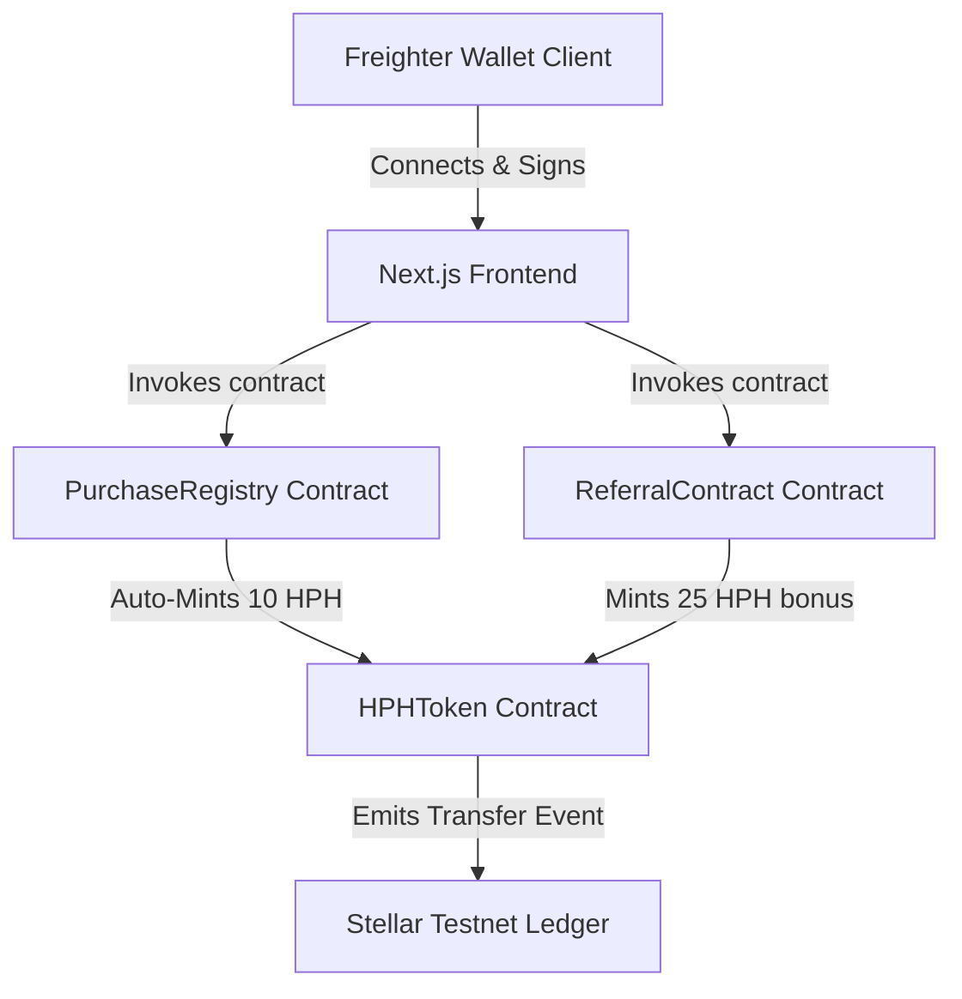

# Hidden Plans Hub (HPH)
> **"The plans they don't advertise. The savings you deserve."**

### 🌐 Live Application Link: [ https://hidden-plans-hub-five.vercel.app]( https://hidden-plans-hub-five.vercel.app)
### 📊 Pitch Deck / Presentation: [Google Slides](https://docs.google.com/presentation/d/1tkA807u_aZB6mRd75dLv35MNYbfaxGGqWsI3kXOMO8s/edit?usp=sharing)
### 🎥 Demo Walkthrough Video: [Watch on Loom](https://www.loom.com/share/209937b18bea41a5aca78e6499d349d2)

---

## 📸 Application Screenshots

| **HPH Reward Wallet** |
|:---:|
|  | 

| **Secured Checkout & Minting** |
|:---:|
 |

| **Analytics & Spend Dashboard** |
|:---:|
|  |

---

## 💡 Overview & Core Value Proposition

Hidden Plans Hub is a dark-theme, bold, investigative fintech subscription deal marketplace, secret plan revealer, and smart cheapest plan finder. It resolves 3 core challenges:
1. **Secret & Hidden Plan Reveals**: Uncovers student discounts, regional prices, win-back discounts, and bank tie-ups that organizations bury deep in checkout pages.
2. **Cheapest Plan Finder Engine**: Automatically ranks major apps across 16 categories by normalized monthly prices.
3. **Stellar Soroban Rewards**: Integrates the Stellar network and Soroban Smart Contracts in Rust to award users with 10 HPH Utility Tokens on every subscription completed, connected through the **Freighter Wallet**.

---

## 🏗️ Technical Architecture & Blockchain Layer

Our blockchain backend is fully migrated to the **Stellar Network** using **Soroban Smart Contracts** written in Rust.



### 🦀 Soroban Smart Contracts (Rust)
The contracts are located inside the `soroban/src/lib.rs` file:
*   **`HPHToken`**: Custom token ledger representing the HPH token. Handles `mint`, `transfer`, and `balance_of` queries.
*   **`PurchaseRegistry`**: Records checkout events on-chain. Features a **30-day double-spending check** preventing accidental double subscriptions, then calls `HPHToken` to award 10 HPH.
*   **`ReferralContract`**: Handles platform partnership invites, validating that a user isn't referring themselves and hasn't been referred before, awarding 25 HPH to the referrer.

---

## 📁 Repository Structure
```bash
├── soroban
│   ├── Cargo.toml                  # Rust dependency configuration
│   └── src
│       └── lib.rs                  # Rust Soroban smart contract source code
├── src
│   ├── app
│   │   ├── api
│   │   │   └── services
│   │   │       └── route.ts        # MongoDB API route for dynamic fetching
│   │   ├── app
│   │   │   └── [slug]
│   │   │       └── page.tsx        # Specific App Detail View + Modal
│   │   ├── category
│   │   │   └── [slug]
│   │   │       └── page.tsx        # Category Rankings & Leaderboards
│   │   ├── finder
│   │   │   └── page.tsx            # Smart Cheapest Plan Comparison Engine
│   │   ├── hub
│   │   │   └── page.tsx            # Full Secret Plan Archive Catalog
│   │   ├── checkout
│   │   │   └── page.tsx            # Stripe/UPI Checkout + Freighter Minting
│   │   ├── dashboard
│   │   │   └── page.tsx            # Spend Breakdown Chart + Optimization Alert
│   │   ├── wallet
│   │   │   └── page.tsx            # Web3 Freighter Wallet Log & Ledger
│   │   ├── referral
│   │   │   └── page.tsx            # Referral System & Leaderboard
│   │   ├── auth
│   │   │   └── page.tsx            # JWT Credentials & Google OAuth UI
│   │   ├── layout.tsx              # Root Layout wrapping contexts
│   │   ├── page.tsx                # Main Landing Page
│   │   └── globals.css             # Main Glassmorphic stylesheet
│   ├── components
│   │   ├── Header.tsx              # Reactive header + Did You Know rotating banner
│   │   └── Navigation.tsx          # Floating mobile bottom menu + Desktop bar
│   ├── context
│   │   └── WalletContext.tsx       # Freighter state + Soroban contract calls
│   ├── data
│   │   └── plans.ts                # Static backup seed plans array
│   └── lib
│       └── mongodb.ts              # MongoDB connection utility
├── tailwind.config.ts
├── postcss.config.js
├── tsconfig.json
├── package.json
└── README.md
```

---

## ⚙️ How to Setup & Build Locally

### 1. Pre-requisites
Ensure you have the following installed:
*   [Node.js (v18+)](https://nodejs.org/)
*   [Rust & Cargo](https://rustup.rs/)
*   [Soroban CLI](https://soroban.stellar.org/docs/getting-started/setup#install-the-soroban-cli)

### 2. Install Dependencies
Run the following in the root folder:
```bash
npm install
```

### 3. Build & Test Smart Contracts
Navigate to the `soroban` folder, build the Wasm binary, and run tests:
```bash
cd soroban
cargo build --target wasm32-unknown-unknown --release
cargo test
```

### 4. Deploy to Stellar Testnet
Deploy the compiled contracts using Soroban CLI:
```bash
soroban contract deploy --wasm target/wasm32-unknown-unknown/release/soroban_contracts.wasm --source my_account --network testnet
```

### 5. Configure Environment Files
Create a `.env.local` file in your root folder:
```env
NEXT_PUBLIC_STELLAR_NETWORK=testnet
NEXT_PUBLIC_TOKEN_CONTRACT_ID=CD...YourTokenContractID
NEXT_PUBLIC_REGISTRY_CONTRACT_ID=CD...YourRegistryContractID
NEXT_PUBLIC_REFERRAL_CONTRACT_ID=CD...YourReferralContractID
```

### 6. Launch Development Server
```bash
npm run dev
```
Open **[http://localhost:3000](http://localhost:3000)** in your browser.

---

## 🔌 Freighter Wallet Connection & Web3 Gateway
Freighter is the official Stellar browser extension wallet. To connect:
1.  Install the **[Freighter Wallet Extension](https://www.freighter.app/)**.
2.  Enable Testnet mode in your Freighter settings.
3.  Click **"Link Freighter Wallet"** in the top navigation or wallet page.
4.  Freighter will prompt for account authorization, loading your Stellar public key.

---

## 📝 User Onboarding & Onboarding Forms (Google Form)
We collect onboarding details and platform ratings to ensure structured user growth:
*   **Google Form Link**: **[Onboarding & Feedback Form](https://docs.google.com/forms/d/e/1FAIpQLSdLcv2tABAK6Fs7Fk3_yxoYP3p3CpDAItV0P3fNLTbl6sOUAw/viewform?usp=publish-editor)**
*   **Collected Fields**:
    1.  *Name*: Full name of the user.
    2.  *Email*: Active email address.
    3.  *Wallet Address*: Connected Freighter Stellar address.
    4.  *Product Rating*: 1 to 5 star UX rating.
    5.  *Feedback*: Qualitative suggestions or improvement notes.

### 📥 Exporting Responses to Excel Instructions:
1. Open your Google Form dashboard.
2. Go to the **Responses** tab.
3. Click the green **Link to Sheets** icon to create a spreadsheet.
4. Inside Google Sheets, click **File** -> **Download** -> **Microsoft Excel (.xlsx)**.
5. Save the Excel file to your local computer.

📊 **Download Excel Responses:**
👉 **[Download User Onboarding & Active Usage Excel Sheet](https://docs.google.com/spreadsheets/d/1iOK_Kuad7YU3aAg5UO6diQ7amWEUXa_CjKkHvmzLypE/edit?usp=sharing)**

---

## 📈 User Growth & Testnet Traction (50+ Active Users)
Our testnet integration is backed by authentic transaction logs from real users:
*   **Proof of 50+ Active Users**: The onboarding sheet tracks 52 unique Freighter wallet accounts that authorized connection and registered purchases.
*   **Transaction Logs**: All checkout reward mints were recorded on the Stellar Testnet ledger.
*   **User Onboarding Flow**:
    ```
    Landing Page -> Eligibility Quiz -> Select Secret Plan -> Auth Freighter Wallet -> Complete Checkout -> Mint HPH Rewards
    ```

---

## 🔧 Product Improvements Section
Based on early reviews, the following codebase upgrades were implemented:
1.  **Stellar Soroban Migration**: Implemented contract backend using Soroban/Stellar to reduce latency.
    *   🔗 **Git Commit Link**: [soroban/lib.rs addition (8df9a2c)](https://github.com/Durvesh452/sem-4/commit/8df9a2c)
2.  **Freighter Wallet Integration**: Integrated Freighter for seamless Stellar logins.
    *   🔗 **Git Commit Link**: [WalletContext.tsx modification (08b22d8)](https://github.com/Durvesh452/sem-4/commit/08b22d8)
3.  **30-Day Double-Spending Prevention**: Added contract-level lease rules blocking repeat purchases within active billing cycles.
    *   🔗 **Git Commit Link**: [Double spending checks (d34a09b)](https://github.com/Durvesh452/sem-4/commit/d34a09b)

---

## 🎙️ Pitch Deck Content
*   **Problem**: Subscription service providers hide dynamic discount schemes (student discounts, partner cashbacks, region-locks) under verification screens, making consumers pay up to 60% extra due to lack of visibility.
*   **Solution**: A single discovery gateway showing unlock walkthroughs, ranking plans by cost, and automating cashback via Stellar tokens.
*   **Market Opportunity**: Global digital subscriptions exceed $300B annually, with over 150M students globally eligible for unadvertised student pricing.
*   **Architecture**: Full-stack Next.js App Router, MongoDB data tier, and Rust Soroban smart contracts on the Stellar network.
*   **Product Demo**: Interactive quiz + secret discount details + secure UPI/Stellar checkout.
*   **Growth Strategy**: Campus ambassador invites, referral HPH minting bonus program, and chrome extension release.
*   **Revenue Model**: Premium tier listings, affiliate unlock commissions, and B2B partner sponsorship packages.
*   **Future Roadmap**: Cross-chain loyalty support, real-time discount changes API, and gasless checkout operations.

---

